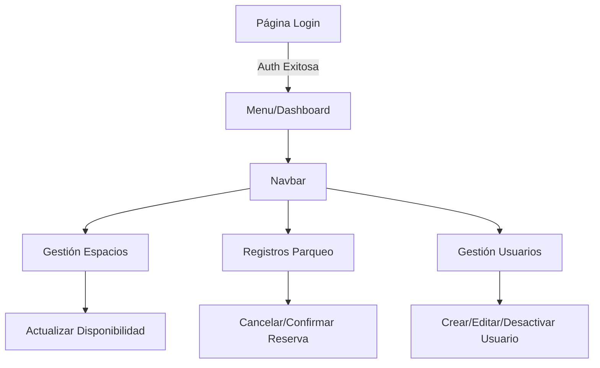

# SIMA Parking Web Dashboard


> **Interfaz administrativa para el Sistema de Parqueo.** Construida con React, esta SPA permite a los administradores gestionar usuarios, ver la disponibilidad de espacios en tiempo real y manejar registros de entrada/salida manualmente.

---

### 👤 Autor
**Creado por Diego Rivera**

[Ver Código en GitHub](https://github.com/dariverap/utparking-react) | [🇺🇸 English Version](./README.md)

---

## 🏗 Arquitectura

### Árbol del Proyecto
```bash
src/
├── css/              # Estilos personalizados (Login.css)
├── pages/            # Componentes de Vista
│   ├── Login.js      # Punto de entrada de Autenticación
│   ├── Menu.js       # Dashboard Principal
│   ├── Navbar.js     # Navegación Compartida
│   ├── Gestion*.js   # Lógica de Gestión (Espacios, Registros)
│   └── CRUD*.js      # Gestión de Usuarios (Crear, Leer, Actualizar)
├── routes/
│   └── Routes.js     # Configuración del Router
└── index.js          # Punto de montaje de la App
```

### Flujo de la Aplicación
La aplicación utiliza Componentes de Clase y gestiona el estado localmente, utilizando `universal-cookie` para la persistencia de sesión.



---

## 🛠 Stack Tecnológico

*   **Framework:** React (Create React App)
*   **Enrutamiento:** `react-router-dom` (v5)
*   **Cliente HTTP:** `axios`
*   **Framework UI:** `react-bootstrap`, `bootstrap`
*   **Gestión de Sesión:** `universal-cookie`
*   **Utilidades:** `date-fns`, `md5`

---

## 🚀 Instalación

1.  **Navegar al directorio frontend:**
    ```bash
    cd frontend
    ```

2.  **Instalar dependencias:**
    ```bash
    npm install
    ```

3.  **Ejecutar la aplicación:**
    ```bash
    npm start
    ```
    *La app se abrirá en http://localhost:3000*

4.  **Compilar para Producción:**
    ```bash
    npm run build
    ```
