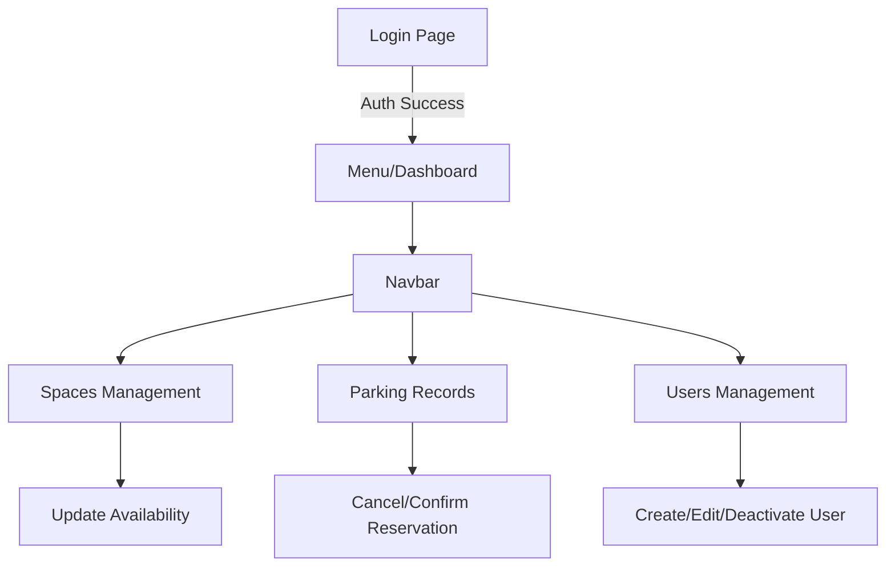

# SIMA Parking Web Dashboard


> **Administrative interface for the Parking System.** Built with React, this SPA allows administrators to manage users, view real-time parking space availability, and handle entry/exit records manually.

---

### 👤 Author
**Created by Diego Rivera**

[View Code on GitHub](https://github.com/dariverap/utparking-react) | [🇪🇸 Versión en Español](./README.es.md)

---

## 🏗 Architecture

### Project Tree
```bash
src/
├── css/              # Custom Styles (Login.css)
├── pages/            # View Components
│   ├── Login.js      # Auth Entry Point
│   ├── Menu.js       # Dashboard Landing
│   ├── Navbar.js     # Shared Navigation
│   ├── Gestion*.js   # Management Logic (Spaces, Records)
│   └── CRUD*.js      # User Management (Create, Read, Update)
├── routes/
│   └── Routes.js     # Router Configuration
└── index.js          # App Mount Point
```

### Application Flow
The application uses Class Components and manages state locally, utilizing `universal-cookie` for session persistence.



---

## 🛠 Tech Stack

*   **Framework:** React (Create React App)
*   **Routing:** `react-router-dom` (v5)
*   **HTTP Client:** `axios`
*   **UI Framework:** `react-bootstrap`, `bootstrap`
*   **Session Management:** `universal-cookie`
*   **Utils:** `date-fns`, `md5`

---

## 🚀 Installation

1.  **Navigate to the frontend directory:**
    ```bash
    cd frontend
    ```

2.  **Install dependencies:**
    ```bash
    npm install
    ```

3.  **Run the application:**
    ```bash
    npm start
    ```
    *The app will open at http://localhost:3000*

4.  **Build for Production:**
    ```bash
    npm run build
    ```
